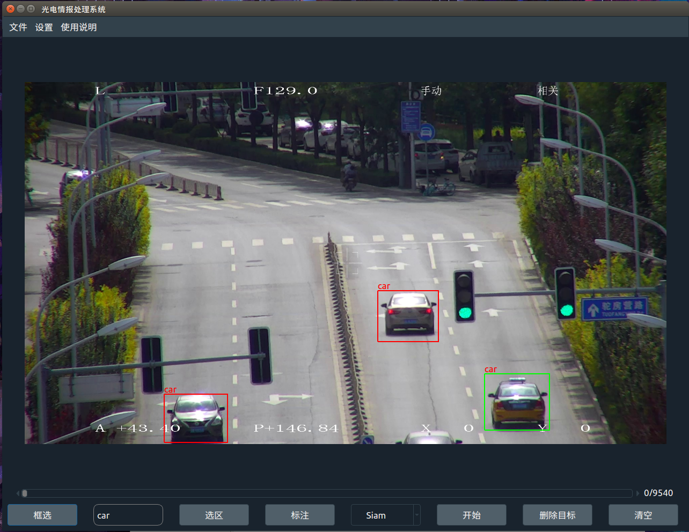

# Auto Video Label Tool

Using tracking algorithm to realize automatic marking of targets in video.

------

## Function

- Support two tracking algorithms (SiamRPN / KCF)
- Automatic video frame cutting
- Set tracking area
- Specify tracking box delete
- UDP video transmission

------

## Environment

python == 3.6
torch >= 1.2
PyQt5 >= 5.15 
QtPy >= 1.9
opencv-contrib-python >= 3.4.2

opencv-python >= 3.4.2